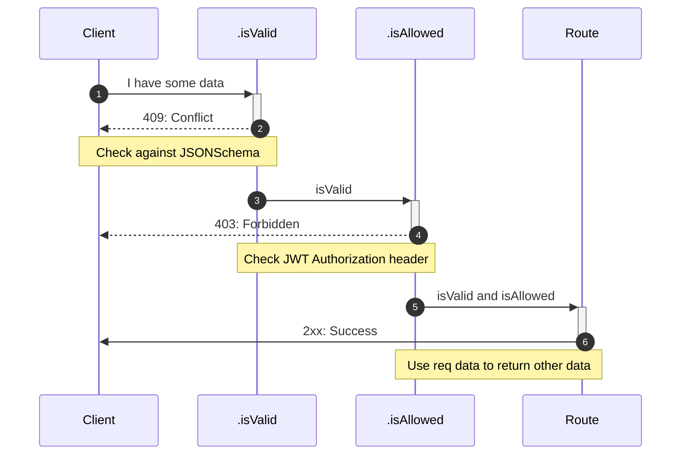

[`mermaid`](https://github.com/knsv/mermaid) sequence diagram. Use [`mermaid-live-editor`](https://mermaidjs.github.io/mermaid-live-editor) to visualize.

```mermaid
sequenceDiagram
    autonumber
    participant Client
    participant .isValid
    participant .isAllowed
    participant Route

    Client ->>+ .isValid: I have some data    
    .isValid -->>- Client: 409: Conflict
    Note over Client,.isValid: Check against JSONSchema 

    .isValid ->>+ .isAllowed: isValid
    .isAllowed -->>- Client: 403: Forbidden
    Note over .isValid,.isAllowed: Check JWT Authorization header

    .isAllowed ->>+ Route: isValid and isAllowed
    Route ->>- Client: 2xx: Success
    Note over .isAllowed,Route: Use req data to return other data
```
